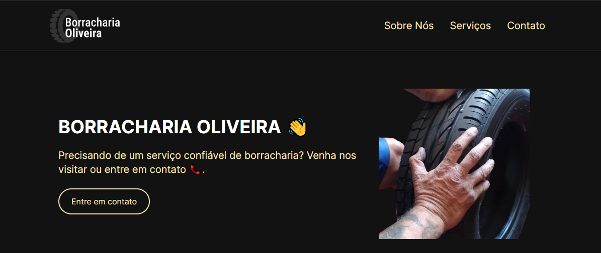

# Landing Page - Borracharia Oliveira

Projeto de um página de informações para contato, serviços e orientações, para uma Borracharia Familiar. 

  

##### A primeira versão 
[acesse aqui](https://helpful-treacle-e1c527.netlify.app/#contact)

## Dependencies

As seguintes dependências são necessárias para este projeto:

- Next.js: Um framework React para renderização no lado do servidor e geração de site estático.
- Tailwind CSS: Um framework CSS altamente personalizável.
- React: Uma biblioteca JavaScript para construir interfaces de usuário.
- React Icons: Uma coleção de ícones populares para projetos React.
- JavaScript.

## License

Este projeto está licenciado sob a Licença MIT. Sinta-se à vontade para usar, modificar e distribuir o código de acordo com os termos da licença.

